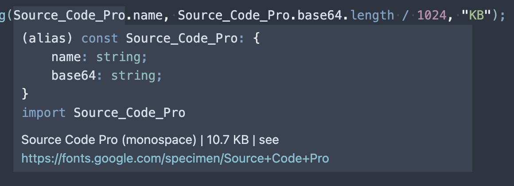

# Nano Font

[](https://www.npmjs.com/package/nano-font)

A Size Limited and TypeScript Friendly Font Collection for Serverless Environment. Including 1300+ Google Fonts!



> The unpacked size (~66 MB) includes all 1,300+ fonts in 3 formats.
> (ESM: ~30 MB, CJS: ~30 MB, DTS: ~6 MB)
>
> The average size of each font is about 22 KB.

## Why?

During the development of [LeetCode Stats Card](https://github.com/JacobLinCool/LeetCode-Stats-Card), a dynamic SVG image generator powered by Cloudflare Workers, I wanted to use fonts that were available on Google Fonts to display the texts.

Then I faced two problems:

1. External fonts are not available in SVG, so I embed the font in base64 format.
2. The size limit of the script is 1MB, so I remove some useless characters to contain more fonts.

Then, I thought if there is a collection to let me directly embed fonts in such an environment, things will be easier.

## Usage

```typescript
import Baloo_2 from "nano-font/fonts/Baloo_2";
// const Baloo_2 = require("nano-font/fonts/Baloo_2");

const my_css = `
font-face { 
    font-family: "${Baloo_2.name}";
    font-style: normal;
    font-weight: 400;
    font-display: swap;
    src: url("${Baloo_2.base64}") format("woff2");
}`;
```

## Fonts

### Font Format & Range

- Format: **woff2**
- Range: **ASCII** (32 ~ 126)

### Fonts Included

[1300+ Fonts](https://jacoblincool.github.io/nano-font/modules/Fonts.html) from Google Fonts.

## Docs

[nano-font Documentation](https://jacoblincool.github.io/nano-font/) (including supported font list)

## Links

- GitHub Repository: <https://github.com/JacobLinCool/nano-font>
- NPM Package: <https://www.npmjs.com/package/nano-font>
- Documentation: <https://jacoblincool.github.io/nano-font/>
